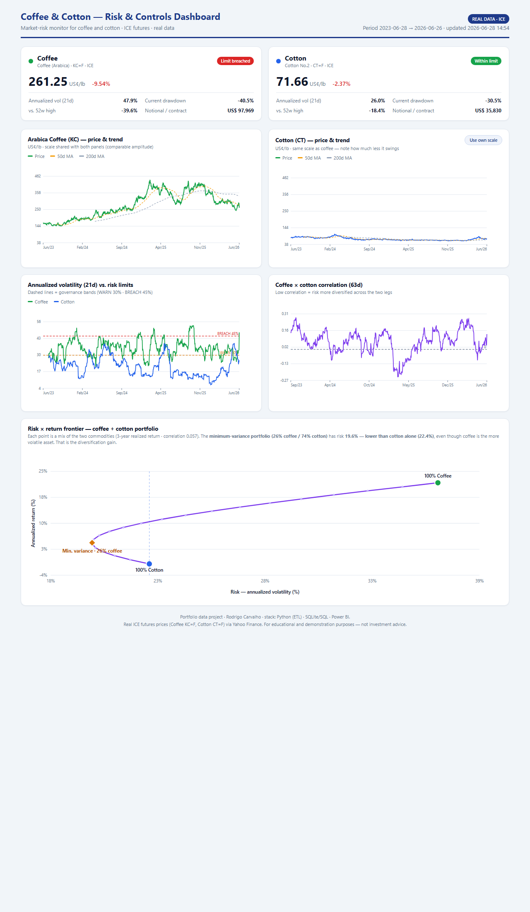

# Coffee & Cotton — Market-Risk Pipeline

**An end-to-end data project: real ICE futures prices → Python ETL → SQL → an interactive,
self-refreshing case study** for the two soft commodities coffee (KC) and cotton (CT).
Everything runs on **real data** from ICE futures (via Yahoo Finance) — nothing synthetic.

🔗 **[Live demo](https://rodrigo-carfon.github.io/projects/coffee-cotton-frontier/)** · refreshed by the scheduled workflow, no server



---

## What it does

A risk desk trading physical commodities needs to answer three questions every day. This
project turns raw daily prices into a page that answers them at a glance:

1. **Where are we now?** — latest price and day change per commodity.
2. **How risky is it?** — annualized volatility against governance limit bands
   (OK / WARN / BREACH), plus current drawdown.
3. **Is the risk concentrated?** — rolling correlation between the two commodities and a
   Markowitz risk×return frontier showing the diversification gain.

## Stack & architecture

```
GitHub Actions (cron)                    ← automated data capture / orchestration
        │  runs the pipeline daily, commits the refreshed data back
        ▼
Yahoo Finance (ICE futures)
        │  yfinance  (with retry)
        ▼
   pipeline.py  ──►  Extract → Transform (risk metrics) → Load
        │
        ├─►  data/commodities.db           (SQLite: prices, daily_metrics, correlation, kpi_snapshot, v_latest_risk)
        ├─►  data/{prices,correlation,kpi_snapshot}.csv  (flat-file exports)
        ├─►  data/commodities_powerbi.xlsx (Excel export of the same data)
        └─►  data/dashboard_data.json       (page payload)
                       │
                       ▼
              build_dashboard.py
                       │
                       ▼
   ../projects/coffee-cotton-frontier/index.html
              (interactive SVG case study, no chart library — rendered straight
               to its public URL, so there is no copy step to forget)
```

**GitHub Actions** schedules the daily capture (see *Automation* below) · **Python**
(pandas / numpy / yfinance) for the ETL · **SQL/SQLite** for storage and analytical queries ·
a **dependency-free, interactive HTML/SVG** page for the live demo.

## Automation (daily data capture)

The capture is orchestrated by **GitHub Actions** — no server to maintain, and every run is
visible in the repo's *Actions* tab:
[`.github/workflows/refresh-commodities.yml`](../.github/workflows/refresh-commodities.yml).

- **Schedule:** `cron: 25 15 * * 1-5` — 15:25 UTC on weekdays (weekends are skipped, since the
  ICE market is closed). Plus a manual *Run workflow* button via `workflow_dispatch`. Scheduled
  runs can be delayed by GitHub; the button runs it immediately.
- **What it does:** installs deps → runs `pipeline.py` (real download, with a light retry
  since Yahoo Finance is intermittent) → runs `build_dashboard.py` → **commits the refreshed
  `data/` and the rendered case study back to the repo** only if something changed. GitHub
  Pages then redeploys the live demo automatically.

## The metrics

| Metric | What it measures |
|---|---|
| **Annualized volatility (21d)** | The size of the price swings — the #1 market-risk measure. Bucketed into OK / WARN (≥30%) / BREACH (≥45%) bands. |
| **Drawdown** | How far the price has fallen from its running peak — the "worst pain". |
| **Distance from 52-week high** | Where the price sits within its yearly range. |
| **Rolling correlation (63d)** | Whether coffee and cotton move together; near 0 = diversified risk. |
| **Risk × return frontier** | Markowitz portfolio curve + the minimum-variance mix of the two commodities. |

See [docs/domain-primer.md](docs/domain-primer.md) for a plain-language explanation of the
domain (ICE, futures, ¢/lb) and every metric.

## Key findings (last 3 years)

- **Coffee nearly tripled** — from ~145 ¢/lb (low) to a peak of 439 ¢/lb — driven by
  drought/frost in Brazil and very low stocks; it is the **riskier** asset (~35% annual
  vol, single-day moves up to ±8%).
- **Cotton went sideways** — started and ended near ~80 ¢/lb, with calmer ~20% vol.
- **Correlation ≈ 0** (0.03–0.14): the two have little to do with each other day to day, so
  holding both is **naturally diversified** — the minimum-variance mix has lower risk than
  cotton alone.
- Both still suffered brutal drawdowns from their tops (coffee −44%, cotton −41%).

## Repository structure

```
.github/workflows/
└── refresh-commodities.yml # scheduled daily capture (GitHub Actions)

projects/coffee-cotton-frontier/
└── index.html              # the published case study (generated — do not hand-edit)

commodity-risk-dashboard/
├── pipeline.py             # ETL: extract → transform (risk metrics) → load
├── build_dashboard.py      # renders the interactive case study from the JSON payload
├── queries.sql             # 10 commented SQL queries over the SQLite DB
├── requirements.txt
├── data/                   # generated artifacts (SQLite DB, CSV/Excel exports, JSON payload)
└── docs/
    ├── domain-primer.md    # the domain + metrics, in plain language
    └── screenshot.png
```

## How to run

```bash
pip install -r requirements.txt
python pipeline.py          # downloads real data → writes data/*.db/.xlsx/.csv/.json
python build_dashboard.py   # renders ../projects/coffee-cotton-frontier/index.html

# The page pulls the site's shared stylesheet from /assets/css/style.css, so
# preview it over HTTP from the repo root rather than opening the file directly:
cd .. && python -m http.server 8000
# → http://localhost:8000/projects/coffee-cotton-frontier/
```

(Or just let the scheduled GitHub Action do it — see *Automation* above.)

Explore the SQL directly:

```bash
sqlite3 data/commodities.db ".read queries.sql"
```

## Data source & disclaimer

Prices are real ICE futures (Coffee `KC=F`, Cotton `CT=F`) retrieved via Yahoo Finance.
This is a portfolio / educational project — **not investment advice**.
