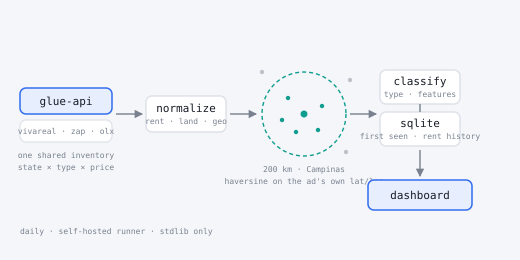

# Countryside Rentals — daily geo-filtered property pipeline

Every rural property advertised for rent within **200 km of Campinas**, collected
daily, deduplicated, classified and served to a static dashboard.

**Dashboard:** <https://rodrigo-carfon.github.io/projects/countryside-rentals/>



> **This is a private tool, not a portfolio piece.** It supports a real family
> property search. The page is deliberately **unlisted** — nothing links to it
> from the portfolio home and it carries `noindex, nofollow` — and its interface
> is in **Portuguese**, because the person using it is. GitHub Pages offers no
> access control, so the URL is shareable-by-link, not private.

---

## What it does

1. **Collect** — reads the JSON endpoint behind Brazil's largest portal network.
   VivaReal, ZAP and OLX share one inventory, so a single source covers all three.
   The endpoint caps a page at 24 results and a query at roughly a thousand, so
   collection is sharded by *state × unit type × rent bucket*, with a land-area
   floor that keeps each shard small.
2. **Locate** — every listing carries its own coordinates, so the radius filter is
   a haversine from Campinas, not a guess from the town name. Anything beyond
   200 km is dropped. No geocoding service, no API key, no municipality table.
3. **Classify** — recovers *chácara / sítio / fazenda* from the ad title (the
   portals flatten all three into one "FARM" type), maps the portal's amenity
   enum and the ad's free text onto one fixed feature vocabulary, and flags the
   listings that match the target profile. Labels are resolved here and stored,
   so the page renders them verbatim and the browser translates nothing.
4. **Store** — SQLite keeps every listing ever seen with its `first_seen_date`
   and a rent history, so "new since yesterday" and "the price just dropped" are
   facts the portals themselves don't expose.
5. **Serve** — a dictionary-encoded columnar `data.json` (~0.5 MB) that the page
   filters entirely client-side.

## Source

| Source | Endpoint | Covers |
|---|---|---|
| `grupozap` | `glue-api.vivareal.com` (falls back to `glue-api.zapimoveis.com.br`) | VivaReal · ZAP · OLX |

Both endpoints were measured over an identical shard grid and returned the same
580 listing ids — intersection 580, unique to either side 0. Querying both would
double the runtime to collect nothing, so ZAP is a standby, used only if VivaReal
fails outright.

Not yet adapted, all confirmed reachable: Chaves na Mão (sitemap + JSON-LD),
Imovelweb, and the specialist rural agencies. Mercado Livre's API requires OAuth
and is out. Adding one is a new module in `sources/` plus one line in
`sources/__init__.py`.

## Architecture

```
glue-api (vivareal / zap / olx)
        │   shard: state × unit type × rent bucket, 24 per page
        ▼
   normalize            sources/_common.py   → one dict shape, contacts scrubbed
        ▼
   geo filter           geo.py               → haversine from Campinas, ≤ 200 km
        ▼
   classify             classify.py          → type · features · target match
        ▼
   SQLite               storage.py           → first seen · rent history · 180d window
        ▼
   data.json            → projects/countryside-rentals/index.html
```

## The target profile

Calibrated on the rental being replaced — **6.000 m² at R$10.000/month**. A
listing is flagged as a match at **R$6.000–14.000** with **at least 4.000 m²** of
land. The thresholds are three constants at the top of `classify.py`; they only
drive a badge and a filter, never what gets collected.

## Two things worth knowing

**It cannot run on a GitHub-hosted runner.** The endpoint answers `200` from a
residential connection and `403` from a datacenter IP — measured, both ways. The
workflow therefore targets a **self-hosted runner**. One-time setup: repo →
Settings → Actions → Runners → *New self-hosted runner* (Windows x64), run the
install script, then `./svc.ps1 install` and `./svc.ps1 start` to register it as a
Windows service so it survives a reboot. If the machine is off when the cron
fires, the job queues and runs when the runner returns.

Consequently `sources/_http.py` sends a browser User-Agent rather than the honest
self-identifying string the jobs pipeline uses — the endpoint rejects anything
whose UA/Origin/Referer don't agree, and there is no polite variant that works.
What is kept from that posture is what actually costs the host something: a single
sequential thread, a 0.4 s gap between requests, and no attempt to work around a
block if one is ever applied.

**No personal data is stored.** The payload includes advertiser phone numbers and
a WhatsApp number, and this repository is public. Those fields are dropped in the
adapter, free-text descriptions are scrubbed of phones, e-mails and links in
`sources/_common.py`, and the served JSON ships no description at all. The listing
URL is the contact channel. `verify_snapshot.py` asserts this on every run.

## Repo layout

```
rentals-dashboard/
├── pipeline.py           orchestrator — collect → merge → geo → classify → store → export
├── geo.py                haversine, the 200 km cut, city-centroid fallback
├── classify.py           property type, feature vocabulary, target-match rule
├── storage.py            SQLite schema, upsert, rent history, columnar snapshot
├── verify_snapshot.py    contract check between the snapshot and the page
├── sources/
│   ├── __init__.py       REGISTRY
│   ├── _http.py          urllib GET + retry/backoff
│   ├── _common.py        normalized listing builder, contact scrubbing
│   └── grupozap.py       the endpoint adapter (+ `--probe` mode)
├── data/rentals.db       durable history (committed)
└── requirements.txt      empty — standard library only
```

## How to run

```bash
cd rentals-dashboard

python -m sources.grupozap          # probe: totalCount per shard, no writes
python pipeline.py --dry-run        # collect + geo + classify, write nothing
python pipeline.py                  # full run → data/rentals.db + data.json
python verify_snapshot.py           # assert the snapshot matches what the page reads
```

Preview the page with `python -m http.server 8000` from the repo root, then open
`localhost:8000/projects/countryside-rentals/`.

Automated daily by
[`.github/workflows/refresh-rentals.yml`](../.github/workflows/refresh-rentals.yml)
at 09:40 UTC (06:40 in Campinas), which commits the refreshed database and
snapshot with `[skip ci]`.

## Disclaimer

Built to support a real, personal property search. The data is a daily read of
public listings and is only as accurate as what the advertisers typed — areas in
particular are frequently entered in the wrong unit. Always confirm on the
listing page before acting on anything here.
